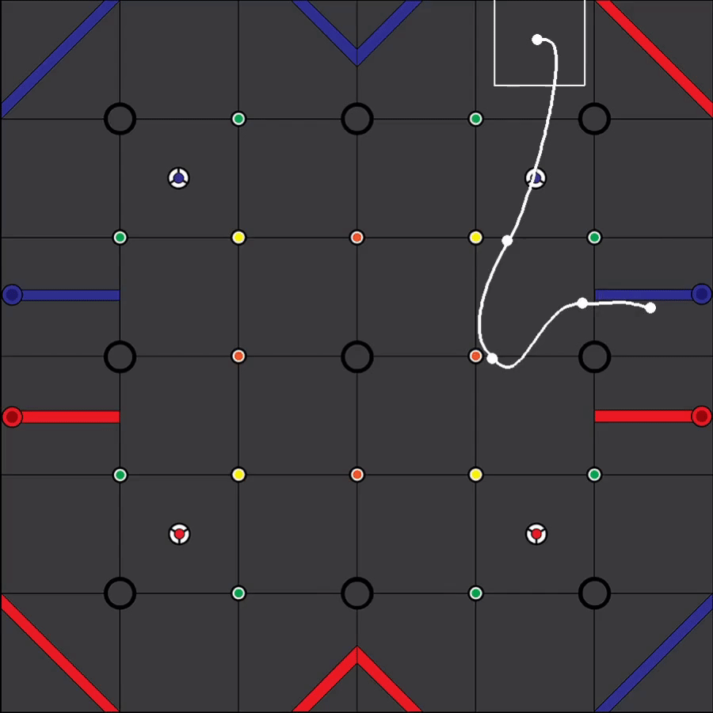

# A Python motion planning library for wheeled mobile robots

Robot trajectory running in the simulator

This is primarily my attempt at replicating the awesome Road Runner library widely used for the First Tech Challenge robotics competition. Besides the obvious inspiration, this library does not  use any piece of code from the Road Runner library. Please check the *References & Credits* below for a complete list.

This library is still in early development so at the moment there is no way to use it in any sensible way and it still lacks many, many features.

For the moment, please check the [Jupyter Notebook](MotionPlanning.ipynb) I have created for a gentle introduction to this type of motion planning.

You might also want to look at the [Java port](https://github.com/VladChira/PathPlannerJava) of this library.

## Requirements
- Python 3.x 
- Scipy
- Pygame for the [simulator](./simulator/main.py)

## Usage
TODO: Come back once its more appropiate

## Roadmap
- Test it on real robots
- Add a path builder object
- Add robot heading support
- Add feedforward and feedback controllers
- Improve performance of path and profile generation

## References & Credits
- [Road Runner Motion Planning library](https://github.com/acmerobotics/road-runner)
- Lau, Boris & Sprunk, Christoph & Burgard, Wolfram. (2009). **Kinodynamic Motion Planning for Mobile Robots Using Splines**. 2009 IEEE/RSJ International Conference on Intelligent Robots and Systems, IROS 2009. 2427-2433. 10.1109/IROS.2009.5354805. 